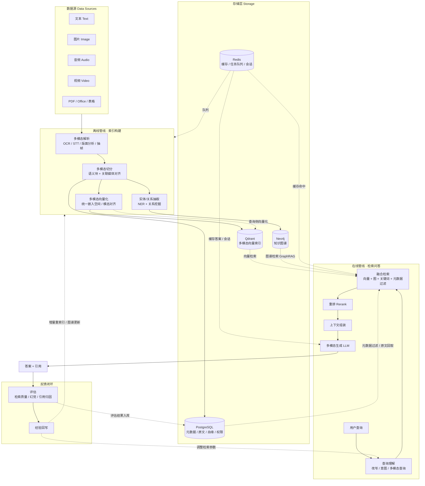

# 议题 33：多模态 RAG 架构（基础设施与管线）

> 状态：讨论中（基础设施已明确，管线边界待定）
>
> 日期：2026-08-07
>
> 适用基线：[架构设计总纲 v0.5](../design/06-架构设计总纲-v0.5.md)、[议题 19 语义计算地基](./19-语义计算地基.md)、[议题 22 语义规范化](./22-语义规范化.md)
>
> 议题范围：为多模态 RAG 系统确定端到端架构：数据源 → 离线索引构建 → 存储层（PostgreSQL/Qdrant/Neo4j/Redis）→ 在线检索问答 → 反馈闭环。本议题当前仅讨论通用多模态 RAG 基线，是否项目化为 llmos 语义计算能力待用户确认。

## 1. 已明确的基础设施

| 基础设施 | 在管线中的角色 |
|---|---|
| **Qdrant** | 向量索引 + 混合检索（dense 多模态向量 + 稀疏向量/BM25） |
| **Neo4j** | 知识图谱：实体关系、跨模态语义链接（文本↔图↔表）、GraphRAG 检索路径 |
| **PostgreSQL** | 规范元数据、chunk 原文与血缘、权限/租户、评估结果、审计 |
| **Redis** | 嵌入缓存、检索结果缓存、摄入任务队列、会话状态、限流 |

## 2. 架构图（Mermaid）

## 3. 设计要点

1. **两条主链路**：离线索引构建（左上）与在线检索问答（右下），通过存储层衔接。
2. **多模态的关键在对齐**：`CHUNK` 阶段将文本与关联图像/音频对齐为同一语义单元；`EMB` 阶段决定统一嵌入空间还是模态分离 + 投影对齐——这是多模态 RAG 与普通 RAG 的最大分叉点。
3. **四路融合检索**：在线检索为向量（Qdrant）+ 图谱（Neo4j）+ 关键词 + 元数据过滤的 `FUSE`，再经重排精排，不是单一向量检索。
4. **Neo4j 承担跨模态关联**：`EXTRACT` 将块间实体/关系及文本↔图↔表语义链接写入图谱，检索时可沿图路径跳转。
5. **PostgreSQL 是事实源**：向量库只存向量，原文与血缘在 PG；Qdrant 命中后回 PG 取原文，权限过滤也在 PG。
6. **Redis 贯穿两端**：在线侧缓存/会话，离线侧摄入任务队列。

## 4. 未决问题

1. **模型层**：嵌入模型/重排模型/生成模型选型；统一嵌入（如 CLIP 系）还是各模态分离嵌入 + 投影对齐。
2. **数据流方向**：Qdrant 命中后回 PG 取原文，还是向量库内冗余存原文。
3. **图归属**：是否项目化为 llmos 语义计算（议题 19/22）能力，还是独立通用系统。
4. **检索融合权重**：向量/图谱/关键词三路结果的融合与重排策略。
